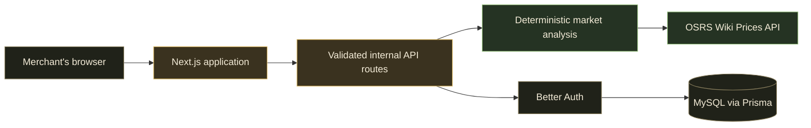

<p align="center">
  
</p>

<p align="center">
  
  
  
  <a href="https://prices.runescape.wiki/"></a>
</p>

<p align="center">
  <strong>Find markets worth investigating—not paper margins worth daydreaming about.</strong><br />
  Merchvision turns public Old School RuneScape market data into conservative, explainable Grand Exchange research.
</p>

---

## What is Merchvision?

Merchvision helps active OSRS merchants narrow thousands of items into a credible shortlist. It combines current quotes with historical spread quality, liquidity, freshness, sample coverage, volatility, confidence, and known buy limits so that a large-looking margin does not automatically become a “good flip.”

It is a **decision-support tool**, not a profit oracle. Current trades are observations; fill speed, executable volume, projected profit, and momentum are estimates with visible uncertainty.

> **The guiding rule:** trust before upside. A repeatable, liquid market should outrank a spectacular but thin or stale spread.

## The toolbelt

| Tool | What it helps you decide | What Merchvision shows |
| --- | --- | --- |
| ⚔️ **Flip Finder — Reliable** | Which short-term markets have repeatable quality? | Seven-day median after-tax margins, conservative GP/hour, buy-limit profit, liquidity, freshness, stability, confidence, and warnings. |
| 🔥 **Flip Finder — High Upside** | Which fresh markets deserve a closer look right now? | Five-minute two-sided coverage, capturable margin, capacity estimates, paired-quote health, confidence, and risk-adjusted GP/hour. Experimental by design. |
| 📈 **Investment Finder** | Which liquid items have sustained recent momentum? | Positive 24-hour and seven-day midpoint trends, volatility, directional consistency, sample coverage, and liquidity. |
| 🔎 **Item Lookup** | Does one specific market hold up under inspection? | Latest quotes, after-tax margin, freshness, price history, warnings, and a local-time Market Rhythm heatmap. |
| 🎒 **Investment Tracker** | What is the current net value of my manually entered purchase lots? | Private purchase lots, prospective GE tax, net liquidation value, unrealized profit, stale quotes, and partial-data states. |
| ⭐ **Favorites** | What do my watched items look like now? | A private watchlist enriched with current public quotes. |

## Why the rankings are different

Merchvision deliberately separates facts, historical measures, and estimates:

| Observed now | Measured from history | Estimated conservatively |
| --- | --- | --- |
| Latest high and low trades | Median after-tax spread | Executable units per hour |
| Quote timestamps and skew | Positive-spread ratio | Conservative GP per hour |
| Public traded volume | Volatility and stability | Buy-limit profit capacity |
| Published buy limits, when known | Sample coverage and confidence | Risk-adjusted opportunity score |

The default **Reliable** score caps scored per-item upside at the seven-day median after-tax margin. Thin volume, sparse samples, unstable spreads, stale or unsynchronized quotes, unknown limits, and suspicious margin spikes reduce trust or produce explicit warnings.

The **High Upside** view accepts more uncertainty, but only after a strict freshness and two-sided-data gate. Its capacity model is a heuristic—not an observed fill rate.

## How it works



- [`lib/osrsWiki.ts`](lib/osrsWiki.ts) is the only direct OSRS Wiki API integration.
- [`lib/scoring.ts`](lib/scoring.ts) and [`lib/upsideScoring.ts`](lib/upsideScoring.ts) own deterministic flip analysis and ranking.
- [`lib/investments.ts`](lib/investments.ts) owns investment momentum analysis.
- [`lib/investmentTracker.ts`](lib/investmentTracker.ts) values private, manually entered purchase lots.
- Process-local TTL caches, request coalescing, bounded shortlists, and lazy chart bundles keep the repeated workflow responsive and respectful of the Wiki API.

For the complete system design, see [Architecture](docs/ARCHITECTURE.md).

## Privacy and boundaries

Merchvision stores only what its current tools need: account records, Favorites, private purchase lots, and bounded public-market calibration observations.

It does **not**:

- Place or observe Grand Exchange offers
- Synchronize RuneLite trades
- Record sales or realized profit
- Reconstruct transaction history
- Save bankroll or allocations
- Guarantee fills, price direction, or profit

Investment Tracker lots are manual and private. They are intentionally not a trade journal. Read the [Product Contract](docs/PRODUCT.md) for the durable product boundaries.

## Run it locally

### Requirements

- Node.js and npm
- A local or reachable MySQL server
- Contact information for the OSRS Wiki API User-Agent

### 1. Install

```bash
git clone https://github.com/RaccoonFive/merchvision.git
cd merchvision
npm install
cp .env.example .env
```

### 2. Configure

Set these values in `.env`:

| Variable | Required | Purpose |
| --- | --- | --- |
| `USER_AGENT_CONTACT` | Yes | Contact information included in the descriptive Wiki API User-Agent. |
| `DATABASE_URL` | Yes | MySQL connection for Prisma and Better Auth. Use a dedicated application user. |
| `BETTER_AUTH_SECRET` | Yes | Private random secret of at least 32 characters. |
| `BETTER_AUTH_URL` | Yes | Application origin, normally `http://localhost:3100` locally. |
| `OSRS_LATEST_CACHE_SECONDS` | No | Latest-price cache TTL; defaults to 60 seconds. |
| `OSRS_MAPPING_CACHE_SECONDS` | No | Item-mapping cache TTL; defaults to 86,400 seconds. |
| `OSRS_TIMESERIES_CACHE_SECONDS` | No | Timeseries and 24-hour-summary cache TTL; defaults to 300 seconds. |
| `CRON_SECRET` | For calibration | Separate bearer secret for the protected 15-minute calibration job and report. |

Never commit `.env` or real credentials. The [MySQL setup guide](docs/mysql-setup.md) includes a least-privilege database bootstrap.

### 3. Prepare the database

```bash
npm run db:generate
npm run db:migrate:deploy
```

### 4. Start exploring

```bash
npm run dev -- -p 3100
```

Open [http://localhost:3100](http://localhost:3100).

## Commands

| Command | Purpose |
| --- | --- |
| `npm run dev -- -p 3100` | Start the development server using `.next-dev`. |
| `npm test` | Run the Vitest suite once. Tests use mocked market data, never the live Wiki API. |
| `npm run typecheck` | Check TypeScript without emitting files. |
| `npm run build` | Create an optimized production build. |
| `npm start -- -p 3100` | Serve the production build. |
| `npm run db:generate` | Generate the Prisma client. |
| `npm run db:migrate:dev` | Create and apply a development migration. |
| `npm run db:migrate:deploy` | Apply committed migrations. |

## Repository map

```text
app/                 Next.js pages and validated API route handlers
components/          Interactive tools, tables, dialogs, charts, and application shell
lib/                 Market logic, scoring, Wiki integration, auth, and persistence helpers
prisma/              MySQL schema and committed migrations
docs/                Product, architecture, calibration, and operational documentation
public/              Theme-aware application icons
AGENTS.md             Durable repository guidance for coding agents
TODO.md               Active milestone, backlog, and delivery history
```

## Project docs

| Document | Start here when… |
| --- | --- |
| [Product Contract](docs/PRODUCT.md) | You want to understand the product principles, privacy boundaries, and non-goals. |
| [Architecture](docs/ARCHITECTURE.md) | You are changing data flow, APIs, caching, authentication, persistence, or scoring. |
| [Roadmap](TODO.md) | You want the active milestone, planned work, or delivery history. |
| [Flip Calibration](docs/flip-calibration.md) | You are operating or evaluating the experimental High Upside model. |
| [MySQL Setup](docs/mysql-setup.md) | You need a local least-privilege database user. |

## Contributing

Before changing behavior, read [`AGENTS.md`](AGENTS.md), the [Product Contract](docs/PRODUCT.md), and the relevant architecture section. Keep market formulas deterministic, keep direct Wiki requests centralized, add focused tests for behavior changes, and preserve the distinction between observations and estimates.

The validation baseline is:

```bash
npm test
npm run typecheck
npm run build
```

## Data source and disclaimer

Market information comes from the community-run [OSRS Wiki Real-Time Prices API](https://prices.runescape.wiki/). Merchvision identifies itself through a configurable User-Agent, bounds timeseries enrichment, and caches responses to avoid unnecessary upstream load.

Merchvision is an independent fan project. It is not affiliated with, endorsed by, or sponsored by Jagex. Old School RuneScape and RuneScape are trademarks of Jagex. Public market observations and every derived estimate may be incomplete, stale, or non-executable—always verify a market before committing GP.

<p align="center">
  <br />
  <strong>Trade the evidence, not the fantasy.</strong>
</p>
